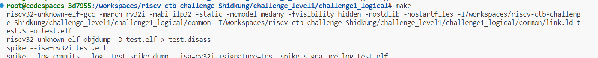
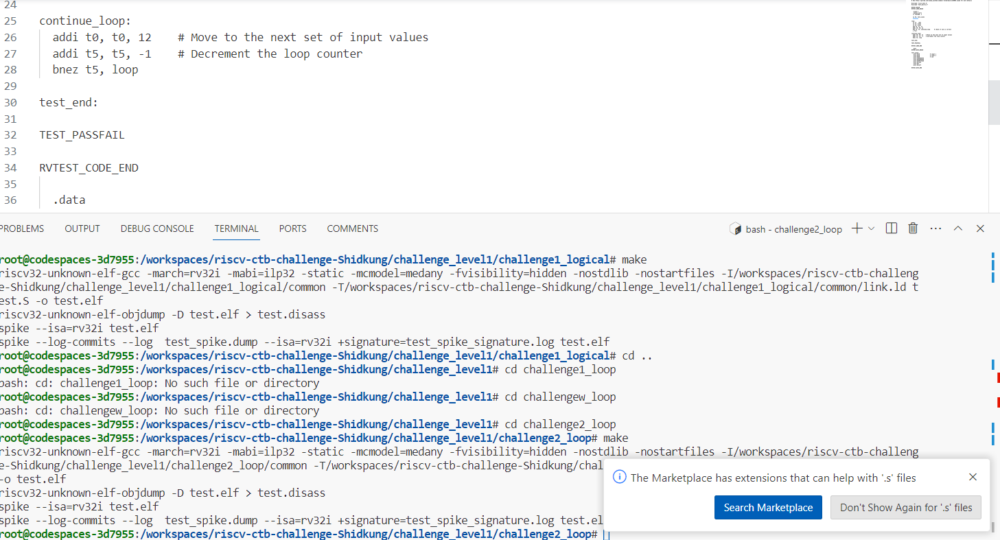
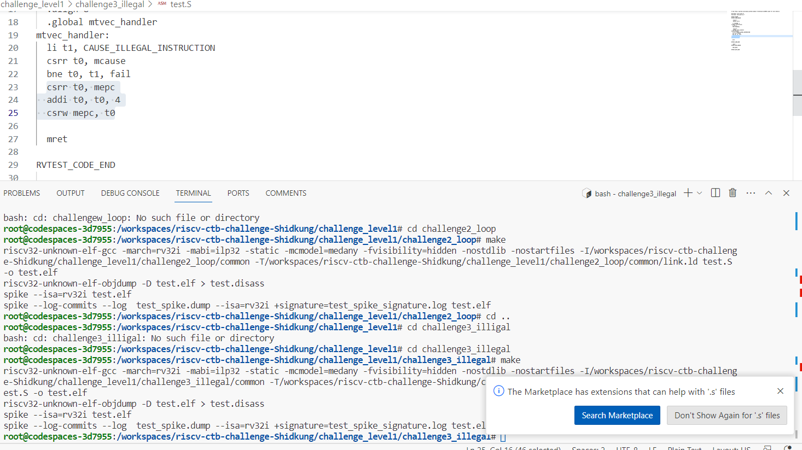
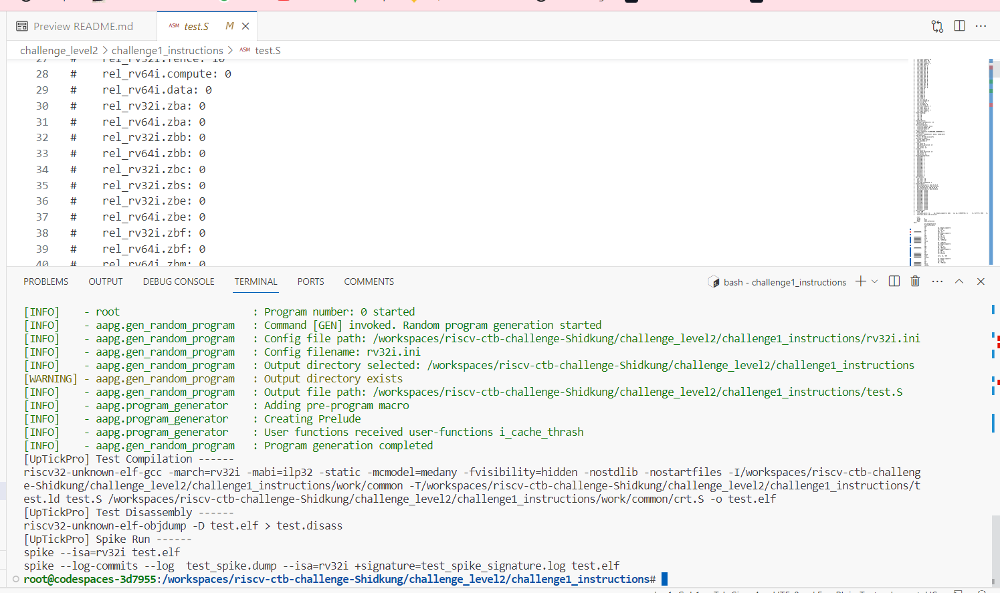
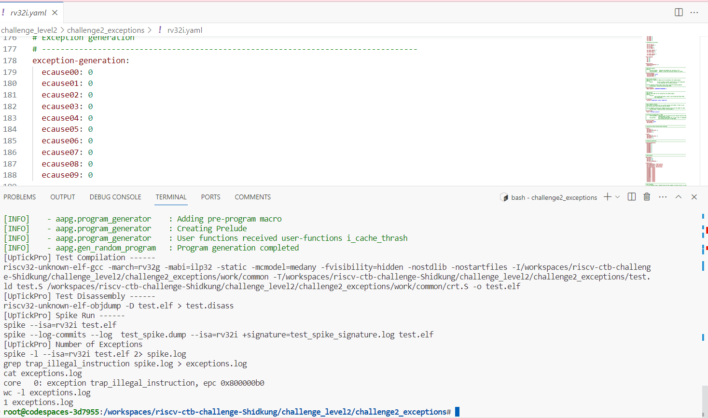

# riscv_ctb_challenges
-----------
# Challenge Level1
Challenge_Level1_Logical:
-----------------------------------------------------
    and a2, s2, t5
	and a6, a2, s10
	and tp, s11, ra
	and s10, s0, tp
	and s3, a2, sp
	and a5, a6, t0
	and sp, a4, a1
	and t2, a4, z4
	and s9, a5, t0
	and s11, a1, a7
	and t3, s8, s0
in this challenge ,there is an error on Z4 because in assembly code in preparation zone
    
	# Preparation
	li s9, 0x06aa934a
	li a2, 0xbb90907f
	li s7, 0xbef962bf
	li t4, 0x585e49a1
	li a1, 0xcc22397b
	li s0, 0x7d9b8cb3
	li s5, 0x5e699bfd
	li a4, 0x26d0e5ad
	li s1, 0x09610f5a
	li s2, 0xc9b5593a
	li t5, 0xe920afcd
	li s10, 0x1748702ab
	li s11, 0x69f94c6ba
	li sp, 0x89883f62
	li t0, 0xba4da205
	li s4, 0xff5df24
	li a7, 0x9623de9
	li s8, 0xd2f5ee1
	li t1, 0x9ed6fb57
	li a3, 0xfec194e4

There not have "z4" but it have "s4" So I fix it by change all "z4" to "s4"

Challenge_Level1_loop:
---------------------------------------
    loop:
	    lw t1,  (t0)
        lw t2, 4(t0)
        lw t3, 8(t0)
        add t4, t1, t2
        addi t0, t0, 12
        beq t3, t4, continue_loop   # check if sum is correct
        j fail
in this loop is checking about t4 and t3 if they have same value it go to other testcase(there have three tase_case)

    test_cases:
        .word 0x20               # input 1
        .word 0x20               # input 2
        .word 0x40               # sum
        .word 0x03034078
        .word 0x5d70344d
        .word 0x607374C5
        .word 0xcafe
        .word 0x1
        .word 0xcaff

So i create other loop for set new testcase and go to loop again(three times)   

    continue_loop:
        addi t0, t0, 12 # Move to the next set of input values
        addi t5, t5, -1 # Decrement the loop counter
        bnez t5, loop  

and set loop counter in t5 

    li t5, 3

  

Challenge_Level1_illigal:
---------- 
    illegal_instruction:
        li t0, 2
        TEST_PASSFAIL

        .align 8
        .global mtvec_handler

    mtvec_handler:
        li t1, CAUSE_ILLEGAL_INSTRUCTION
        csrr t0, mcause
        bne t0, t1, fail
        csrr t0, mepc

        mret

in this challenge its test illigal instruction:
TEST_PASSFAIL and i add this to code

    csrr t0, mepc
    addi t0, t0, 4
    csrw mepc, t0

for check fail test I think?

# Challenge_Level2
------
 Challenge_Level2_instruction:
 ---------
        isa-instruction-distribution:
    #    rel_sys: 0
    #    rel_sys.csr: 0
    #    rel_rv32i.ctrl: 0
    #    rel_rv32i.compute: 10
    #    rel_rv32i.data: 10
    #    rel_rv32i.fence: 10
    #    rel_rv64i.compute: 0
    #    rel_rv64i.data: 0
    #    rel_rv32i.zba: 0
    #    rel_rv64i.zba: 0
    #    rel_rv32i.zbb: 0
    #    rel_rv64i.zbb: 0
    #    rel_rv32i.zbc: 0
    #    rel_rv32i.zbs: 0
    #    rel_rv32i.zbe: 0
    #    rel_rv64i.zbe: 0
    #    rel_rv32i.zbf: 0
    #    rel_rv64i.zbf: 0
    #    rel_rv64i.zbm: 0
    #    rel_rv32i.zbp: 0
    #    rel_rv64i.zbp: 0
    #    rel_rv32i.zbr: 0
    #    rel_rv64i.zbr: 0
    #    rel_rv32i.zbt: 0
    #    rel_rv64i.zbt: 0
    #    rel_rv32m: 0
    #    rel_rv64m: 0
    #    rel_rv32a: 0
    #    rel_rv64a: 0
    #    rel_rv32f: 0
    #    rel_rv64f: 0
    #    rel_rv32d: 0
    #    rel_rv64d: 0
    #    rel_rvc.ctrl: 0
    #    rel_rvc.compute: 0
    #    rel_rvc.sp: 0
    #    rel_rvc.data: 0
    #    rel_rvc.fdata: 0
    #    rel_rv32c.compute: 0
    #    rel_rv32c.ctrl: 0
    #    rel_rv32c.fdata: 0
    #    rel_rv64c.compute: 0
    #    rel_rv64c.data: 0
in this challenge i think it was about 32bits and 64bits and for riscv is run on 32bits but in this test.S file have 

    rel_rv64c.compute: 10 
this is cause of error because its run on 32bits but its have compute in 64bits

Challenge_Level2_exception:
--------
in this challenge its not have config file for make and that it  i create new configs file and have 

    exception-generation:
        ecause00: 0
        ecause01: 0
        ecause02: 0
        ecause03: 0
        ecause04: 0
        ecause05: 0
        ecause06: 0
        ecause07: 0
        ecause08: 0
        ecause09: 0
I set exception-generate have 10 cause

# Challenge_level3 

for this challenge I cannot analyze it because my skill .

I cant find anything 

but in next challenge I think I can do it better .

thanks for this challenge , I have new skill about assembly and other thing in this challenge 
and See you .
--
# BYE